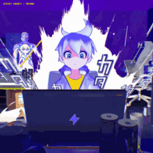

### <picture></picture> *Languages and Tools🧰*

  

#

## <picture></picture>*About Me* 

- 🎓 High school student, book writer, tech programmer.
- 💻 Passionate about writing romantic books and programming.
- 🧠 Constantly seeking growth and improvement.
- 📚 Believer in the power of god and smart work.

### 📊 Stats

 

  

<h2 align="center"><b>Connect with me</b></h2>
   
 
 

### Contact Me

  

    

### My Projects

Stay tuned for updates on my latest projects!

### Fun Fact

I believe that coding is like solving puzzles – challenging yet incredibly rewarding once you crack it!

Thanks for stopping by! 🚀

  

   
  
<b>Visitors Count</b>
  
  

 
   

